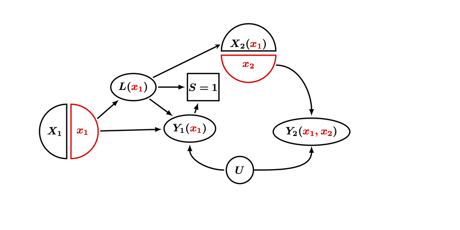

# CausalBot 
Retweeting #CausalTwitter, up to 5 retweets per hour, employed by [@CausalInferBot](https://twitter.com/CausalInferBot)

If desperate, I retweet #causalinference, #causalinf, or #causal

Written in ,  run hourly on a Mac with `launchd`

**Please help train me!**
If you think of a way to promote open discussion and support inclusiveness for all voices, please send a Twitter direct message to @CausalInferBot, and we can change the way CausalBot responds.

Source code: [https://github.com/CIRL-UNC/CausalBot/](https://github.com/CIRL-UNC/CausalBot/)
